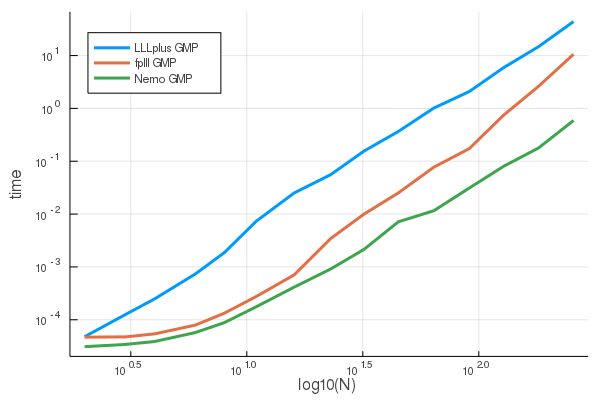
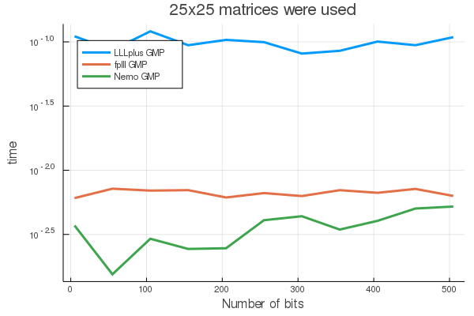

# CompareLLLs

This repo shows results from a few Monte-Carlo comparisons of
[LLL](https://en.wikipedia.org/wiki/Lenstra%E2%80%93Lenstra%E2%80%93Lov%C3%A1sz_lattice_basis_reduction_algorithm)
lattice reduction code from
[LLLplus](https://github.com/christianpeel/LLLplus.jl),
[Nemo.jl](https://github.com/Nemocas/Nemo.jl), and the
[fplll](https://github.com/fplll/fplll) C++ library. These simulations
are done in Julia; LLLplus is written in native Julia, Nemo has a good
Julia interface, and we use Cxx.jl to access the fplll library.
We also comment briefly later on in this page on a few steps required
to write a Julia wrapper around fplll.

### Comparison Results

The figures below show the time for execution of three different LLL
algorithms, each which does a matrix decomposition:

* The `lll` function from LLLplus,
* The `lll_reduction` function from fplll, and
* The `lll_with_transform` function from Nemo.

The parameter `δ` was set to `0.99` for all three, with `η` fixed to
`0.51` for fplll and Nemo. 

The first figure shows execution time as a function of matrix size.
The x-axis shows the matrix size on a log scale; matrices of size `d =
2 .^(1:.5:8)` where used. I.e. matrices from size `2` to `256`. Each
matrix consists of uniformly random `20`-bit integers obtained from
fplll's `gen_uniform` function. LLLplus and fplll can do operations on
both native 64-bit integers, and arbitrary-precision integers using
GMP, while Nemo appears to only work on GMP integers. So even though
the bit sizes are small enough to use native 64-bit arithmetic, all
three algorithms were passed matrices of GMP integers. The time shown
for each size is the average over six random matrices.

Nemo is always the fastest, followed by fplll, and finally LLLplus is
the slowest. It is surprising to me that Nemo is fastest, given that
it is not focused on lattice tools. It's clear that Nemo is much
faster than LLLplus, though they seem to have the same slope in this
log-log plot, which implies the same polynomial exponent. Though not
shown, a similar relationship between the times of LLLplus and fplll
on matrices of 64-bit integers was found, though of course the timese
are faster than on GMP integers.

The second figure fixes the matrix size to `25x25`, and shows average
time versus the bit depth, which is varied from `5` to `505` in
increments of `50` bits. Again, Nemo is fastest, then fplll, while
LLLplus is slowest. The curves are roughly flat, though Nemo's times
do grow slowly with bit depth. 

### Generating the comparisons above

CompareLLLs is not a useful Julia package, even though it has the
start of the structure of one. If you want to generate the plots shown
above, say using the code in the file `timeLLLs.jl`, then the
following steps may be useful.

* Download and compile fplll, which means you have to install GMP and MPFR.
* Download or compile a [Julia](https://github.com/juliaLang/julia)
  binary. It may be useful to compile with the `USE_SYSTEM_GMP` and
  `USE_SYSTEM_MPFR` variables set to `1` in `Make.inc` so that Julia
  and fplll use the same GMP and MPFR libraries.
* Download this repo. If you don't want to change code in this
  package, put it in a sibling directory to the fplll directory. If
  you put it elsewhere, change the appropriate line at the beginning
  of `timeLLLs.jl`.
* Execute the code in `timeLLLs.jl`.

### Making a polished Julia wrapper of fplll

I (Chris) started the code in this repo with the idea of making a
Julia wrapper around fplll. After looking at this further, it appears
that this would be a very big task, Nemo.jl already offers similar or
faster speed than fplll as shown above, and even if I did make a
`fplll.jl` wrapper around fplll, I may be the only user. Since this is
merely an educational exercise for me, I'll spend my time on 
[LLLplus](https://github.com/christianpeel/LLLplus.jl).

Even so, the following list of tasks may be helpful for someone who is
thinking of building a polished `fplll.jl` package that provides a
full interface to fplll--something on the same level as the Python
library [fpylll](https://github.com/fplll/fpylll).

* Decide whether you'll use Cxx.jl or
  [CxxWrap.jl](https://github.com/JuliaInterop/CxxWrap.jl); CxxWrap.jl
  may require a bit more work, yet it appears more stable.  In Oct
  2019 Cxx.jl has 90 open issues on Github, and appears to be
  accumulating open issues faster than commits are happening.
* Build a wrapper around the fplll binaries using
  [BinaryBuilder.jl](https://github.com/JuliaPackaging/BinaryBuilder.jl),
  with changes to make sure that the binaries point to the same GMP
  and MPFR libraries as Julia uses. 
* Map the fplll usage of GMP ints (mpz or whatever) to Julia's
  BigInts. Or at least understand the differences between fplll and
  Julia's usage of GMP. Do the same for fplll's use of MPFR and
  Julia's use of MPFR for BigFloats.  For inspiration you could look
  at how Nemo.jl wraps GMP into the Julia type `fmpz`.
* Map the fplll matrix and vector types to new Julia datatypes so that
  they could be used directly by the core fplll lattice
  functions. I.e. do something like Nemo's `MatrixSpace`. 
  Implement appropriate operators, wrapper functions, and testing. 

