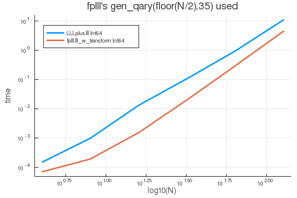
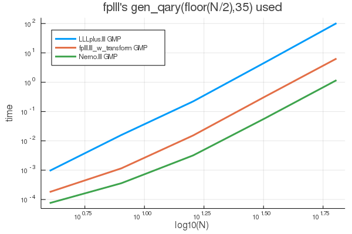
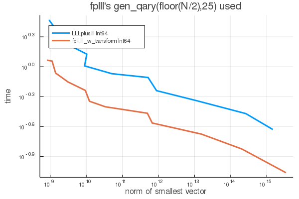

# Comparing three LLL implementations

This page shows results from a few Monte-Carlo comparisons of
[LLL](https://en.wikipedia.org/wiki/Lenstra%E2%80%93Lenstra%E2%80%93Lov%C3%A1sz_lattice_basis_reduction_algorithm)
lattice reduction code from
[LLLplus](https://github.com/christianpeel/LLLplus.jl),
[Nemo.jl](https://github.com/Nemocas/Nemo.jl), and the
[fplll](https://github.com/fplll/fplll) library. The code
controling the simulations is written in Julia; LLLplus is written in
native Julia, Nemo has a Julia interface that wraps an LLL from the
FLINT C library, and we use Cxx.jl to access the fplll C++ library.
We also comment later on in this page on what might be required
to write an easy-to-use Julia wrapper around fplll.

### Comparison Results

The figures below show the time for execution of three different LLL
algorithms, with each configured to do a matrix-decomposition-style LLL:

* The `lll` function from LLLplus,
* The `lll_reduction` function from fplll, and
* The `lll_with_transform` function from Nemo.

The parameter `δ` was set to `0.99` for all three, with `η` fixed to
`0.51` for fplll and Nemo. LLLplus and fplll can do operations on
native 64-bit integers and arbitrary-precision integers using GMP,
while Nemo appears to only work on GMP integers.

The first figure shows execution time as a function of matrix size for
Int64 bases. The x-axis shows the matrix size on a log scale; matrices
of size `d = 2 .^(2:7)` where used. I.e. matrices from size `4` to
`128`. Each matrix consists of q-ary `35`-bit lattices generated with
fplll's `gen_qary` function with `k=N/2`. For this
initial plot, we show results for LLLplus and fplll when passed
native-precision 64-bit integer bases. The time shown for each size is
the average over eight random matrices. At the largest dimensions
(128), these q-ary lattices are entering the area of cryptographic
interest.

fplll is fastest, which is expected given that it is developed by
academics who do research in lattice reduction. LLLplus is within a
factor of 2.5 for the largest size (128) bases; i.e. LLLplus takes
about 2.5 times longer than fplll.  This is good news, given that
fplll uses the faster L2 (Cholesky-based) technique from Nguyen and
Stele and has received significantly more attention.

The next plot shows a similar test, except with GMP (BigInt) data. The
same bit depth in `gen_qary` is used, though (of course) it could be
larger. In this case Nemo is always the fastest, followed by fplll,
and finally LLLplus is the slowest. One guess is that Nemo is so fast
because it detects the lower precision (low bit-depth) data, and
does part or all of the computation in native precision. The only
option available with GMP data for fplll is the `proved` LLL
technique; there is no `fast` technique as was used for native
precision. It may be that the fplll authors have not attempted to
make their code especially fast with arbitrary precision.

One question that could arise in the "time-vs-basis size" plots above
is what the quality of the basis is. In the final plot we show
execution time vs the norm of the first vector in the reduced
basis. This first vector is typically the smallest; its norm is an
rough indication of the quality of the reduced basis. We show the norm
averaged over eight random bases. Q-ary lattices are used, with depth
`25` bits, and native-precision integers. The curve is created by
varying the `δ` parameter from `.49` to `.99` in steps of `.05`; the
larger times and smaller norms correspond to the largest `δ` values.
fplll consistently out-performs LLLplus.

Code to generate the plots shown above is in the file `timeLLLs.jl`,
though it is possible that `Cxx.jl` may be tricky to use.

### Making a polished Julia wrapper of fplll

I (Chris) started the code in this repo with the idea of making a
Julia wrapper around fplll. After looking at this further, it appears
that this would be a very big task, Nemo.jl already offers similar or
faster speed than fplll as shown above, and even if I did make a
`fplll.jl` wrapper around fplll, I may be the only user. Since this is
merely an educational exercise for me, I'll spend my time on 
[LLLplus](https://github.com/christianpeel/LLLplus.jl).

Even so, the following list of tasks may be helpful for someone who is
thinking of building a polished `fplll.jl` package that provides a
full interface to fplll--something on the same level as the Python
library [fpylll](https://github.com/fplll/fpylll).

* Decide whether you'll use
  [Cxx.jl](https://github.com/JuliaInterop/Cxx.jl) or
  [CxxWrap.jl](https://github.com/JuliaInterop/CxxWrap.jl); CxxWrap.jl
  may require a bit more work, yet it appears more stable.  In Oct
  2019 Cxx.jl has 90 open issues on Github, and appears to be
  accumulating open issues faster than commits are happening.
* Build a wrapper around the fplll binaries using
  [BinaryBuilder.jl](https://github.com/JuliaPackaging/BinaryBuilder.jl),
  with changes to make sure that the binaries point to the same GMP
  and MPFR libraries as Julia uses. 
* Map the fplll usage of GMP ints (mpz or whatever) to Julia's
  BigInts. Or at least understand the differences between fplll and
  Julia's usage of GMP. Do the same for fplll's use of MPFR and
  Julia's use of MPFR for BigFloats.  For inspiration you could look
  at how Nemo.jl wraps GMP into the Julia type `fmpz`.
* Map the fplll matrix and vector types to new Julia datatypes so that
  they could be used directly by the core fplll lattice
  functions. I.e. do something like Nemo's `MatrixSpace`. 
  Implement appropriate operators, wrapper functions, and testing. 
